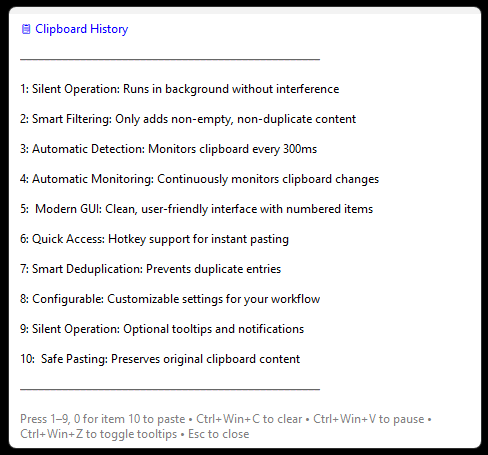

# 📋 Clipboard History Manager

A powerful AutoHotkey v2 script that provides advanced clipboard management with a modern GUI interface. Automatically monitors your clipboard and maintains a history of copied items for quick access and pasting.

## ✨ Features

- **🔄 Automatic Monitoring**: Continuously monitors clipboard changes
- **📱 Modern GUI**: Clean, user-friendly interface with numbered items
- **⚡ Quick Access**: Hotkey support for instant pasting
- **🎯 Smart Deduplication**: Prevents duplicate entries
- **🔧 Configurable**: Customizable settings for your workflow
- **🔇 Silent Operation**: Optional tooltips and notifications
- **🛡️ Safe Pasting**: Preserves original clipboard content

  

## 🚀 Quick Start

1. **Download**: Save `ClipboardHistory.ahk` to your computer
2. **Install**: Ensure AutoHotkey v2 is installed
3. **Run**: Double-click the script to start
4. **Use**: Press `Win+V` to open the clipboard history menu

## ⌨️ Hotkeys

### Main Functions
| Hotkey | Action |
|--------|--------|
| `Win+V` | Open/close clipboard history menu |
| `Ctrl+Win+C` | Clear clipboard history |
| `Ctrl+Win+V` | Pause/resume clipboard watching |
| `Ctrl+Win+Z` | Toggle tooltips on/off |

### Menu Controls (when menu is open)
| Hotkey | Action |
|--------|--------|
| `1-9` | Paste items 1-9 from history |
| `0` | Paste item 10 from history |
| `Esc` | Close menu |

### Debug & Testing
| Hotkey | Action |
|--------|--------|
| `Ctrl+Win+T` | Add test item to history |
| `Ctrl+Win+D` | Show debug information |
| `Ctrl+Win+U` | Force unregister all hotkeys |

## 🎛️ Configuration

The script includes configurable settings in the `settings` object:

```autohotkey
global settings := {
    maxItems: 10,              ; Maximum items in history
    checkInterval: 300,         ; Clipboard check interval (ms)
    autoHideDelay: 8000,       ; Menu auto-hide delay (ms)
    maxDisplayLength: 150,      ; Max text length in menu
    showTooltips: false,        ; Show tooltips (default: off)
    soundOnPaste: false         ; Play sound on paste
}
```

## 🔧 How It Works

### Clipboard Monitoring
- **Automatic Detection**: Monitors clipboard every 300ms
- **Smart Filtering**: Only adds non-empty, non-duplicate content
- **Silent Operation**: Runs in background without interference

### GUI Interface
- **Modern Design**: Clean, readable interface
- **Numbered Items**: Easy selection with number keys
- **Auto-Positioning**: Appears in optimal screen location
- **Auto-Hide**: Closes automatically after 8 seconds

### Pasting System
- **Safe Method**: Temporarily replaces clipboard, then restores
- **Fallback Support**: Direct input if clipboard method fails
- **No Interference**: Temporarily disables monitoring during paste

## 📋 Requirements

- **AutoHotkey v2.0+**: Required for script execution
- **Windows 10/11**: Tested on Windows 10 and 11
- **No Admin Rights**: Runs without elevated privileges

## 🛠️ Installation

### Method 1: Direct Download
1. Download `ClipboardHistory.ahk`
2. Install [AutoHotkey v2](https://www.autohotkey.com/)
3. Double-click the script to run

### Method 2: GitHub Clone
```bash
git clone https://github.com/pejv1/clipboard-history-manager.git
cd clipboard-history-manager
# Double-click ClipboardHistory.ahk to run
```

## 🔄 Usage

### Basic Usage
1. **Copy Text**: Use `Ctrl+C` as normal
2. **Open Menu**: Press `Win+V`
3. **Select Item**: Press number key (1-9, 0)
4. **Item Pasted**: Automatically pastes and closes menu

### Advanced Features
- **Pause Monitoring**: `Ctrl+Win+V` to pause/resume
- **Clear History**: `Ctrl+Win+C` to clear all items
- **Toggle Tooltips**: `Ctrl+Win+Z` to show/hide notifications
- **Debug Info**: `Ctrl+Win+D` to see current status

## 🎯 Use Cases

### For Developers
- **Code Snippets**: Quick access to frequently used code
- **Debug Output**: Store and reuse debug messages
- **API Responses**: Save and reuse API responses

### For Writers
- **Research Notes**: Store research snippets
- **Quotes**: Collect and reuse quotes
- **Draft Content**: Store partial content for later use

### For General Users
- **Contact Info**: Store phone numbers, emails
- **Addresses**: Save delivery addresses
- **Form Data**: Store frequently used form information

## 🔧 Troubleshooting

### Common Issues

**Script won't start**
- Ensure AutoHotkey v2 is installed
- Check Windows security settings
- Run as administrator if needed

**Hotkeys not working**
- Press `Ctrl+Win+U` to force unregister hotkeys
- Restart the script
- Check for conflicting software

**Menu not appearing**
- Press `Ctrl+Win+D` to check debug info
- Ensure clipboard has content
- Check if monitoring is paused

### Debug Commands
- `Ctrl+Win+D`: Shows current status and history length
- `Ctrl+Win+T`: Adds test item to verify functionality
- `Ctrl+Win+U`: Emergency hotkey unregistration

## 🤝 Contributing

Contributions are welcome! Please feel free to submit issues, feature requests, or pull requests.

### Development Setup
1. Fork the repository
2. Create a feature branch
3. Make your changes
4. Test thoroughly
5. Submit a pull request

## 📄 License

This project is licensed under the MIT License - see the [LICENSE](LICENSE) file for details.

## 🙏 Acknowledgments

- Built with [AutoHotkey v2](https://www.autohotkey.com/)
- Inspired by modern clipboard managers
- Community feedback and testing

## 📞 Support

- **Issues**: [GitHub Issues](https://github.com/pejv1/clipboard-history-manager/issues)
- **Discussions**: [GitHub Discussions](https://github.com/pejv1/clipboard-history-manager/discussions)
- **Wiki**: [Project Wiki](https://github.com/pejv1/clipboard-history-manager/wiki)

---

**⭐ Star this repository if you find it useful!**

**🔄 Keep updated**: Watch for new releases and features. 
